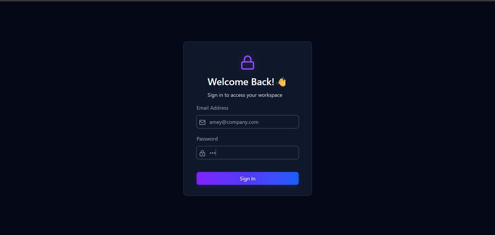
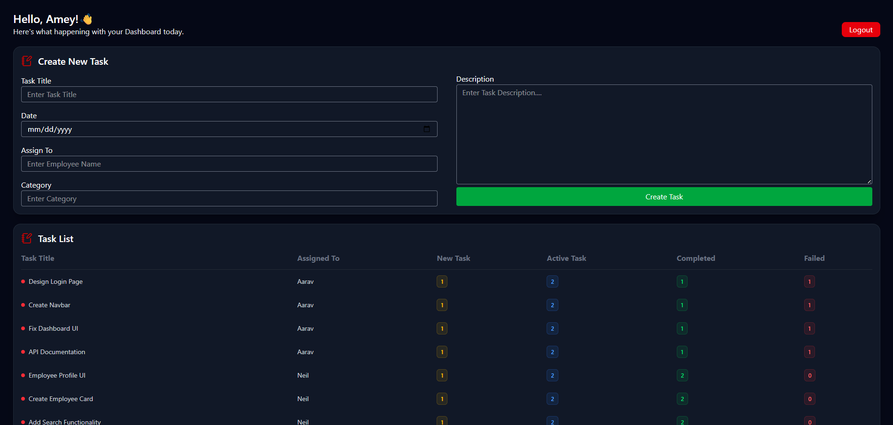
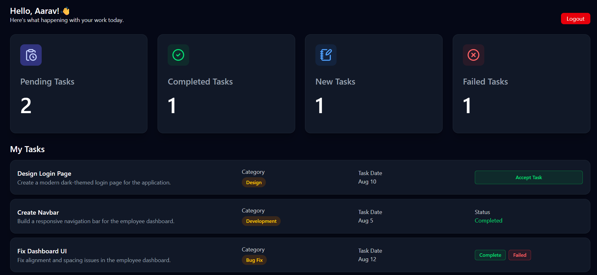

# Employee Management System

A task management dashboard built with React and Tailwind CSS, featuring separate dashboards for administrators and employees.

## 🔗 Live Demo

[View Live Demo](https://employee-management-system-amey-pawar.vercel.app)

## 🚀 Features

### Admin Dashboard
- Create and assign tasks to employees
- View employee task statistics
- Track new, active, completed and failed tasks
- Manage tasks from a centralized dashboard

### Employee Dashboard
- View assigned tasks
- Accept new tasks
- Mark tasks as completed
- Mark tasks as failed
- View task statistics
- Track personal task progress

### Authentication
- Separate admin and employee login
- Persistent login using localStorage
- Role-based dashboard access

## 🛠️ Tech Stack

- React.js
- JavaScript
- Tailwind CSS
- Vite
- Lucide React
- LocalStorage

## 📁 Project Structure

```text
src/
├── assets/
├── components/
│   ├── auth/
│   ├── Dashboard/
│   ├── others/
│   └── Tasklist/
├── context/
├── utils/
├── App.jsx
├── index.css
└── main.jsx

## Screenshots

### Login



### Admin Dashboard



### Employee Dashboard

