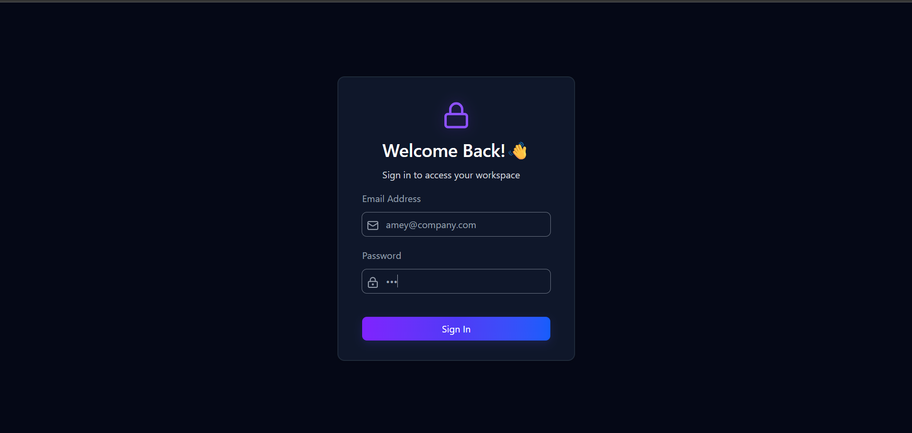
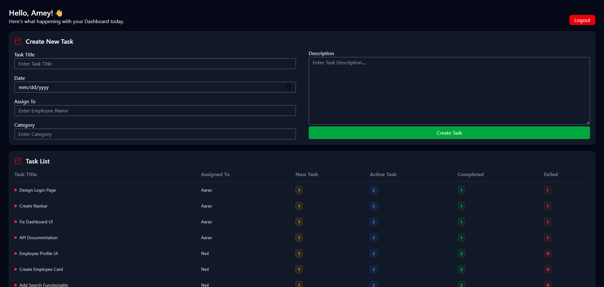
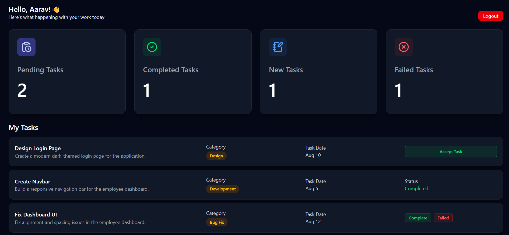

# Employee Management System

A full-stack Employee Management System built with React, Node.js, Express.js, and PostgreSQL. The application provides separate dashboards for administrators and employees, with JWT authentication, role-based authorization, and task management.

## 🔗 Live Demo

- **Live Website:** https://employee-management-system-seven-umber.vercel.app/
- **Backend API:** https://employee-management-backend-hwsy.onrender.com/

## 📸 Screenshots

### Login Page


### Admin Dashboard


### Employee Dashboard


## 📌 About The Project

The Employee Management System simplifies task assignment and employee task tracking.

Administrators can create, assign, edit, delete, and monitor tasks, while employees can view assigned tasks and update their task status.

The application uses a REST API architecture, PostgreSQL for persistent data storage, and JWT-based authentication for secure access.

---

## 🚀 Features

### 👨‍💼 Admin Dashboard
- Create and assign tasks to employees
- View all tasks and employee details
- Edit and delete tasks
- Track task status
- Manage tasks from a centralized dashboard

### 👨‍💻 Employee Dashboard
- View assigned tasks
- Accept new tasks
- Mark tasks as active
- Mark tasks as completed or failed
- View task statistics and personal progress

### 🔐 Authentication & Authorization
- JWT-based authentication
- Password hashing using bcrypt
- Separate Admin and Employee roles
- Role-based API authorization
- Protected API routes

---

## 🛠️ Tech Stack

**Frontend**
- React.js
- JavaScript
- Tailwind CSS
- Vite
- Lucide React

**Backend**
- Node.js
- Express.js
- REST API
- PostgreSQL
- `pg`
- JSON Web Token (JWT)
- bcrypt
- CORS
- dotenv

**Database & Deployment**
- Supabase PostgreSQL
- Render (Backend)
- Vercel (Frontend)

---

## 🏗️ System Architecture

```text
React Frontend (Vercel)
        |
        | HTTP / REST API
        v
Node.js + Express.js (Render)
        |
        | SQL Queries
        v
PostgreSQL Database (Supabase)
```

---

## 🗄️ Database

### Users

```text
users
├── id
├── first_name
├── email
├── password_hash
├── role
└── created_at
```

### Tasks

```text
tasks
├── id
├── title
├── description
├── task_date
├── category
├── status
├── employee_id
└── created_at
```

### Task Status
- New
- Active
- Completed
- Failed

---

## 🔌 API Endpoints

### Authentication

| Method | Endpoint | Description |
|---|---|---|
| POST | `/api/auth/login` | Authenticate a user |

### Tasks

| Method | Endpoint | Description |
|---|---|---|
| GET | `/api/tasks` | Get all tasks (Admin) |
| POST | `/api/tasks` | Create a task (Admin) |
| PUT | `/api/tasks/:id` | Update a task (Admin) |
| DELETE | `/api/tasks/:id` | Delete a task (Admin) |
| GET | `/api/tasks/my-tasks` | Get logged-in employee's tasks |
| PATCH | `/api/tasks/:id/status` | Update task status (Employee) |
| GET | `/api/tasks/employees` | Get employee list (Admin) |

Protected endpoints require a valid JWT in the `Authorization` header.

---

## 🔐 Security
- JWT authentication
- bcrypt password hashing
- Role-based authorization
- Protected API routes
- Parameterized PostgreSQL queries
- Environment variables for sensitive configuration

---

## ⚙️ Installation

### 1. Clone the repository

```bash
git clone https://github.com/ameyy02/Employee-Management-System.git
cd Employee-Management-System
```

### 2. Install frontend dependencies

```bash
npm install
```

### 3. Install backend dependencies

```bash
cd backend
npm install
```

### 4. Configure environment variables

Create `backend/.env`:

```env
PORT=5000
DATABASE_URL=your_postgresql_connection_string
JWT_SECRET=your_jwt_secret
```

Use your own database connection string and a strong JWT secret. Never commit `.env` files.

### 5. Start the backend

From the `backend` directory:

```bash
npm run dev
```

### 6. Start the frontend

Open another terminal in the project root:

```bash
npm run dev
```

---

## 🔮 Future Improvements
- Real-time task updates
- Task search and filtering
- Employee profile management
- Admin analytics
- Email notifications
- Password reset
- Improved mobile responsiveness

---

## 🚀 Deployment

- **Frontend:** Vercel
- **Backend:** Render
- **Database:** Supabase PostgreSQL

---

## 👨‍💻 Author

**Amey Pawar**

- GitHub: https://github.com/ameyy02
- Project Repository: https://github.com/ameyy02/Employee-Management-System